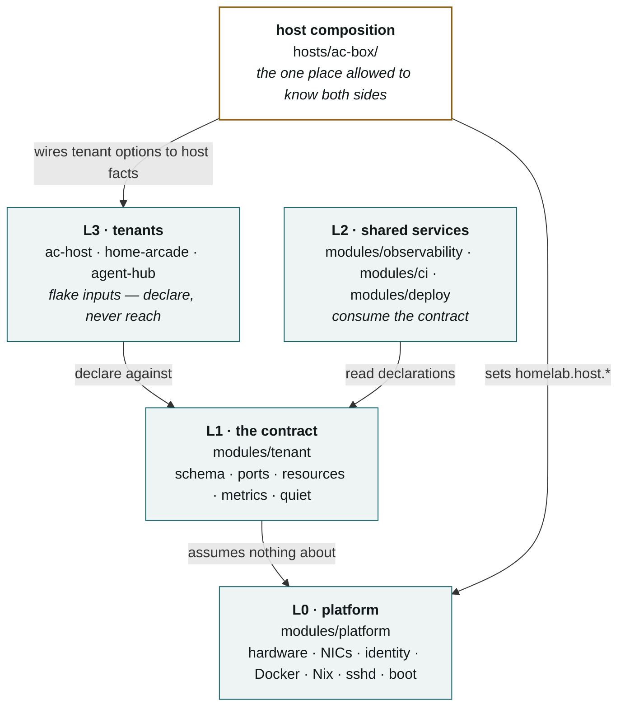
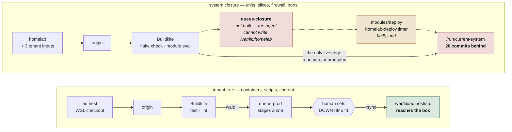
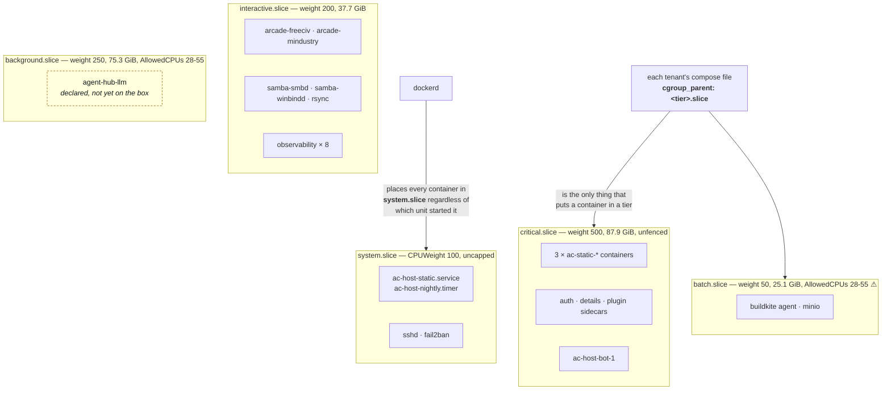
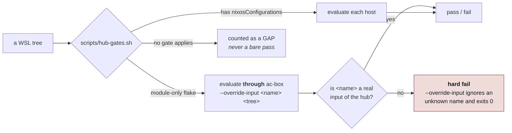

# Architecture

Tracked, diffable diagrams of how ac-box is put together. Mermaid rather than
an image or an external link, for three reasons that have already bitten this
repo: a diagram in git is reviewable in the same diff as the change it
describes, it can be corrected when the code moves, and it does not depend on a
URL outside version control staying alive. `README.md` and
`docs/current-state.md` both still link to hosted pages; those are companions,
not the record.

Facts here are load-bearing and dated. When one stops being true, fix it in the
same commit that made it false — the same rule `docs/current-state.md` runs on.
Last verified against the box 9 Sep 2026.

---

## 1. The layers, and which way they may point

`README.md` states this as a table. The part a table cannot show is that the
dependency arrow only ever points one way, which is the whole design.

**L0 knows nothing about tenants. L1 knows only the schema. L2 reads
declarations. L3 declares without knowing its neighbours.** A tenant that
reaches sideways — into another tenant's state, or down into host facts it
guesses rather than reads — is the bug this structure exists to make visible.

`hosts/ac-box/` is the deliberate exception: something has to hand `arcade-hub`
the LAN address, and the host composition is the one place allowed to know both
sides. When a module hardcodes a host fact instead, that is the failure mode —
see finding F6 in `docs/current-state.md`, where `modules/observability`
carried `192.168.1.1` twice.

---

## 2. Two delivery paths, and where each one stops

The single most misread thing about this box. Code reaches ac-box by two
entirely separate routes that share a CI system and nothing else.

Both paths end at a human. The difference is that the top one ends at a human
**who is prompted** — `queue-prod` stages a sha and `hub-status.sh` reports it
as pending until applied. The bottom path staged nothing and was checked by
nothing, which is how 15 commits accrued silently under a green verdict.
`hub-status.sh` now reports closure drift, which is the read side of the fix.

`home-arcade` and `agent-hub` are **flake inputs, not deploy targets** — they
reach the box only through homelab's closure, so they inherit the same stall.

**Why the missing edge is not simply a Buildkite step** (ADR 0006): the agent
that would run it is a container *on ac-box*, and once `homelab.ci.enable`
lands it is a systemd unit owned by the very closure being switched. A switch
running on it kills the job midway. That is a circularity, not a risk to be
managed — so the applying step must be something systemd owns, outside the
agent. `modules/deploy` is that, built and proven inert, waiting on a bind
mount the agent does not currently have.

---

## 3. Where work actually runs

The tier model fences systemd units. It **cannot** fence Docker containers, and
that is the subtlety worth drawing rather than describing (ADR 0005).

Two things this picture says that prose keeps failing to:

**Assetto's containers are fenced; its units are not.** `ac-host-static.service`
stays in `system.slice` on purpose — `resources.nix` assigns `Slice=` only when
`tier != critical` **and** `quiet.drainable`, because `Slice=` applies at unit
start and restarting `ac-host-static` means `docker rm -f` on three live race
servers. What is *meant* to protect racing is the fence — keeping background
and batch off the cores races use — rather than confining races. Note the
tense: that fence does not yet work, for the reason immediately below.

**`background` and `batch` share one fence, live.** Both carry
`AllowedCPUs = 28-55` — read off the box, not off the config. On this dual
E5-2680 v4, CPUs 28–55 are the SMT *siblings* of 0–27, one per physical core,
so the fence hands the two yielding tiers the second thread of every core:
it fences nothing physically, and gives a memory-bandwidth-bound workload the
worst possible CPU set. A Buildkite Nix build would land on exactly the cores
the model server is meant to be pinned to, separated only by `CPUWeight`
(50 vs 250) — a share, not an isolation.

`3fef4fe` fixes this by doing the arithmetic in physical cores and expanding
through `threadsPerCore`, giving `background` cores 3–25 and `batch` 26–27 plus
their siblings. It is committed and **not deployed** — one of the 20. The
figures above are what the box enforces today, deliberately, because a diagram
of the intended state is how the last set of stale comments happened.

**Slicing the unit that runs `docker compose` does nothing.** `dockerd` places
container scopes under `system.slice` no matter who invoked it, so a
Docker-based tenant in a fenced tier looks protected and is not. Only
`cgroup_parent` in the tenant's own compose file actually moves it.
`resources.nix` emits a warning for exactly this case, because the contract
cannot see another repo's compose file and must flag the risk without claiming
to know it was handled.

---

## 4. What gates a change before it reaches the box

`ac-host`, `home-arcade` and `agent-hub` are all module-only flakes. Before
this, their Nix gate was skipped in silence and `agent-hub` ran *no* gates while
printing a bare pass.

**Coverage caveat, and it matters more once ADR 0006 is live:** a composed eval
proves what is *reachable* from ac-box's config, not a whole module. `agent-hub`
is imported with `services.agent-hub.enable` defaulting false, so its gate
proves its option declarations compose and little of its config body. That is
fine while a human runs the switch. It is thinner than it looks when nobody
does.
