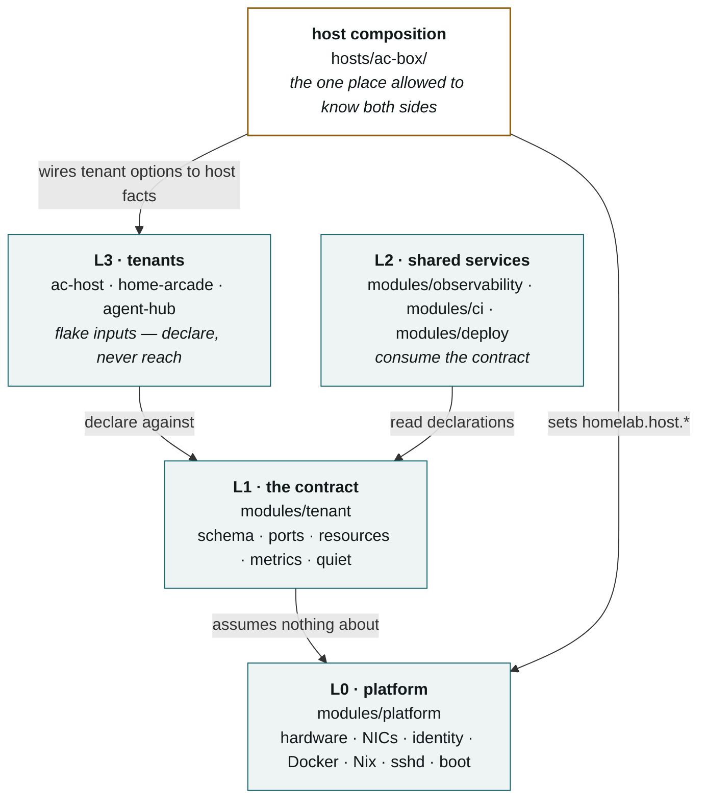
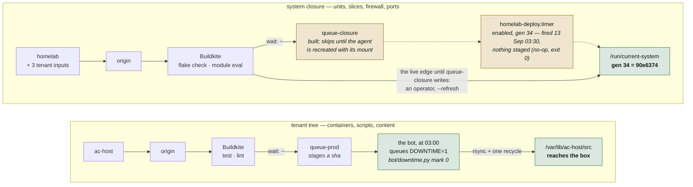
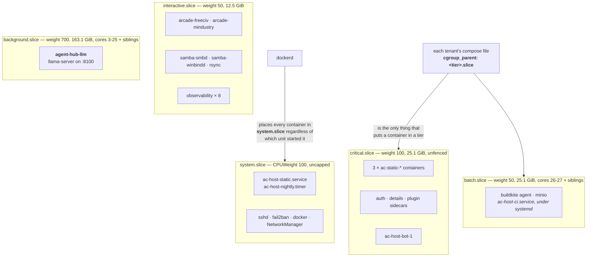
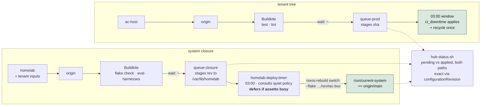
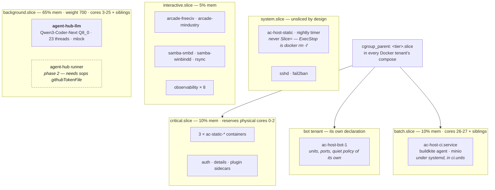

# Architecture

Two architectures, and the distance between them.

**Part I** is what ac-box enforces *today*, read off the box rather than off the
config. As of 12 Sep 2026 evening those are one commit apart — generation 34 is `90e6374`,
HEAD one docs commit past it — but the rule stands, because the three days before that
they were 25 commits apart and drawing the config as the current state is how
this repo's stale comments got written.
**Part II** is the target: not a wish list, but the design the repo already
commits to in `README.md`, the ADRs and the module headers, drawn as one
picture. **Part III** is the delta — every gap between the two, what closes it,
and where that stands.

Mermaid rather than an image or a hosted link, so a diagram is reviewed in the
same diff as the change it describes and corrected when the code moves. Facts
here are load-bearing and dated; when one stops being true, fix it in the same
commit that made it false. Part I last verified against the box **12 Sep 2026 21:23 CDT, at
generation 34** (`90e6374`; deploy timer armed; it fired Sun 13 Sep 03:30, a no-op with nothing staged).

---

# Part I — Current

## I.1 The layers

The structure is already the target structure; this is the one part of the
design that is fully built. `README.md` states it as a table. The part a table
cannot show is that the dependency arrow only ever points one way.

**L0 knows nothing about tenants. L1 knows only the schema. L2 reads
declarations. L3 declares without knowing its neighbours.** A module that
reaches sideways or guesses a host fact instead of reading it is the bug this
structure makes visible — `modules/observability` carried `192.168.1.1` twice
until `6e18170`, and that was the last such literal in the module layer.

## I.2 How code reaches the box today

The single most misread thing about this machine. Two entirely separate routes
share a CI system and nothing else, and only one of them is wired.

**The top path has no human on it, and has not for some time.** This document,
ADR 0006's context section and `hub-status.sh` all said "a human sets
`DOWNTIME=1`". Read off the box on 12 Sep: the Discord bot's countdown posts
that build itself at mark 0 (`bot/bot.py` `fire_downtime_mark`), and
`last-downtime.json` shows it did so at 03:00:11 that morning with nobody
present. `queue-prod` stages, the bot applies, the lobbies recycle once behind
a ten-minute countdown. The one lobby bounce on this machine is that one, and
it is the designed one. What that path *depends on* is two things: the bot
container being up at 02:59, **and a live `BUILDKITE_API_TOKEN` in
`/var/lib/ac-host/.env`** — the bot only *asks* Buildkite for the build. The
first was checked from 13 Sep; the second was not, and it is the one that
failed that morning. Evidence, 13 Sep: `ac-host` `e72c1e4` went green at 01:28
CDT and `queue-prod` staged it (build 36). At 03:00 the countdown ran its
300/60/30/5/0 marks and at mark 0 logged `downtime pipeline trigger failed:
Buildkite trigger failed HTTP 401` — to docker logs only, nowhere a human
looks. `ac-host-nightly` recycled blackhawk/road-america/gingerman at 03:00:01
on the old tree `340b4fb`; `last-downtime.json` still reads
`{"date":"2026-09-12","sha":"","at":"2026-09-12T08:00:11Z"}`. At 08:50 a `GET
https://api.buildkite.com/v2/access-token` with the token from `.env` returned
401: the token is dead, and `.env`'s mtime is 6 Sep. So "the bot is up" was
true all night and proved nothing. `hub-status.sh` now prints that file's date
next to the bot's uptime and makes it a verdict when a tree is pending and the
date is behind the 03:00 that should have applied it. `ac-host` `596b970`
(bead `.49`) has the bot post a trigger failure to `#server-status` and
validate the token at startup — staged by build 38, and it reaches the box
only through the very build that needs the rotated token first.

**The bottom path ends at a timer as of generation 34** (`homelab.deploy.enable
= true`, switched 12 Sep 20:50 CDT by hand — the last hand switch). Its first
firing was Sunday 13 Sep 03:30:03: `homelab-deploy.service` logged "nothing
staged at /var/lib/homelab/pending-closure.json; nothing to do" and exited
clean — the timer has now been watched firing, on its no-op path. It stages
nothing yet because the agent lacks its mount, and the 04:00 recreate that
morning came from the *old* compose, so it still lacks it (row 2, row 29).
Until `1c6827f` this path was checked by
nothing; it is *current* today because an operator switched it.
`home-arcade` and `agent-hub` are flake inputs, not deploy targets: they reach
the box only through homelab's closure, and only when `flake.lock` moves —
row 24, and the bump-lock step built 13 Sep.

**Why the applying edge is not simply a Buildkite step** (ADR 0006): the agent
that would run it is a container *on ac-box* and, since generation 31, a
systemd unit owned by the very closure being switched. A switch running on it
kills the job midway — a circularity, not a risk to be managed. So CI only
*stages* (`queue-closure`, one file, nothing bounced) and a systemd unit on the
box applies. Both halves are in git as of 12 Sep evening and the unit is
enabled as of generation 34. What turned the dotted edges solid was `homelab.deploy.enable`,
one line, and it was deliberately the operator's — an agent's attempt to commit
it was stopped by the harness classifier, correctly.

**And a hazard the diagram cannot show:** a bare `github:imkarrer/homelab` ref
is cached by nix for an hour. A switch at 12:51 today resolved to the rev cached
at 12:00, built the identical closure, and applied a no-op while reporting
success. The deploy unit is immune (it stages a full sha); a human switch is not
— always `--refresh`. `hub-status.sh`'s cheap check could not see this; only
`HUB_STATUS_EXACT=1` could, which is why `configurationRevision` is now set.

## I.3 Where work runs today

Live values from `systemctl show`. These are the *old* tier defaults; the
rebalance is among the undeployed commits.

**Assetto's containers are fenced; its units are not.** `ac-host-static.service`
stays in `system.slice` on purpose — `resources.nix` assigns `Slice=` only when
`tier != critical` **and** `quiet.drainable`, because `Slice=` applies at unit
start and restarting `ac-host-static` means `docker rm -f` on three live race
servers.

**The fence now fences.** Until generation 30, `background` and `batch` both
carried `AllowedCPUs = 28-55` — on this dual E5-2680 v4 those are the SMT
*siblings* of 0–27, so the fence handed the yielding tiers the second thread of
every core and isolated nothing. `3fef4fe` does the arithmetic in physical
cores: background holds 3–25 and siblings 31–53, batch 26–27 and 54–55, and
cores 0–2 with siblings 28–30 stay with the unsliced racing stack. Background's
weight 700 against `system.slice`'s 100 ranks the model server *above* racing
under contention — deliberate; the fence is what protects racing, not the
weight.

**Slicing the unit that runs `docker compose` does nothing.** `dockerd` places
container scopes under `system.slice` no matter who invoked it. Only
`cgroup_parent` in the tenant's own compose file moves a container (ADR 0005).

## I.4 Tenants, network, secrets — as enforced

| | Current |
| --- | --- |
| **Tenants** | 5 declared and 5 in the inventory: `assetto` (bot still inside it as a compose profile), `arcade`, `agent-hub` (**running**), `observability`, `ci` (**under systemd**, `units = [ "ac-host-ci.service" ]`). |
| **Network** | `enp8s0` carries everything — LAN, forwarded AC traffic, sshd. `eno1` is cabled and **down**; `mgmt` scope exists in the schema and nothing may use it until the interface has an address. |
| **Secrets** | Hand-placed files: `/var/lib/monitoring/secrets/*`, `compose/.env.buildkite`, `whitelist.json`. `tenants.<name>.secrets` names them; nothing provisions them. |
| **Metrics** | Five scrape jobs, all loopback. `agent-hub-llm` serves `/metrics` on the LAN address and is unscraped — `metricsEndpoint` has no address field. |
| **Gates** | Every tree evaluated (`1c6827f`), skips counted. `agent-hub`'s enable flag is now true in the composition, so its body is reached by the composed eval. |
| **Reporting** | `hub-status.sh` reports closure drift as a hard lower bound; exact mode behind `HUB_STATUS_EXACT=1` says CLEAN. `Configuration Revision: Unknown` on every generation. |

---

# Part II — Target

What the repo already says it is building, drawn as one picture. Every claim
below is sourced to a file that states it; nothing here is invented for the
diagram.

## II.1 How code reaches the box

Both paths staged in CI, both applied on the box by systemd inside the
maintenance window, both reported as a pending/applied pair. **No human at an
SSH prompt on the path.** (ADR 0006, `README.md` goal 3.)

Properties the target must hold, none optional (ADR 0006 "Consequences"):

- **The drain policy is consulted, never assumed.** The deploy unit's
  `busyCheck` is the only thing between a merge and `docker rm -f` on live race
  servers. It defers; it never drains. It fails closed if the inventory is
  unreadable. *Built and tested — `modules/deploy`.*
- **Every tree that reaches the box has a real gate**, including `agent-hub`'s
  config body once its enable flag is on in the composition.
- **`deploy=buildkite` for homelab in `hub/repos.psv`** — at which point
  `agent-push=yes` means an agent pushing green is, indirectly, scheduling a
  system switch. Reconsider that flag at the same time, not after.

## II.2 Where work runs

The fence computed in **physical cores** and expanded through
`threadsPerCore` (`3fef4fe`); shares rebalanced to point the machine at the
model server (`45f67ab`, `0de8c09`); every workload in a tier and every tier
holding what it exists for.

Two consequences `configuration.nix` states out loud and the picture should
too: **background's CPUWeight 700 ranks the model server above racing under
contention**, because assetto's processes live in `system.slice` at weight 100.
That is deliberate. What protects racing is the *fence* — cores 0–2 and their
siblings are outside background's and batch's `AllowedCPUs` entirely — not the
weight. And **`critical.cpuShare` is not about how much CPU assetto gets**: its
slice is empty. It is the input to `reservedForCritical`, i.e. how many
physical cores the fence keeps for everything unsliced.

## II.3 Tenants, network, secrets — as designed

| | Target | Stated in |
| --- | --- | --- |
| **Tenants** | 6: `assetto`, `bot` (split out — "after phase 6", which has landed), `arcade`, `agent-hub` (llm **and** runner), `observability`, `ci` (`units = [ "ac-host-ci.service" ]`). Every running unit in exactly one tenant's `units`. | `README.md` tenant names; `modules/ci` header; `configuration.nix` agent-hub block |
| **Network** | `eno1` up as the **management** interface, with an address, so `scope = "mgmt"` stops being a schema-only word and `ports.nix` can open something on it. **Which services move there is not stated anywhere in the repo** — sshd and the observability UIs are the obvious candidates, but that is a decision to record (an ADR), not a fact to draw. | `host.nix` ("the dual-NIC runbook brings this up as management"); `schema.nix` `portScope`; ADR 0004 |
| **Secrets** | Credentials via **sops-nix**, named in `tenants.<name>.secrets` and provisioned by the platform. `whitelist.json` stays box state, by design — third-party IDs, never git. | `README.md` "Everything is public except one file"; `schema.nix` `secrets` |
| **Metrics** | Every tenant with an endpoint scraped, including `agent-hub-llm` on the LAN address — needs `metricsEndpoint.address`, a **schema** change, not a `metrics.nix` change. | `metrics.nix` header; `tenants.nix` agent-hub `metrics = null` comment |
| **Gates** | Composed eval reaches every module body that will run; harnesses exposed as flake `checks` (expected-throw cases inverted via `tryEval`). | `docs/current-state.md` F7 follow-up |
| **Reporting** | `system.configurationRevision` set from the flake, so the running closure is self-identifying and drift is exact, not a lower bound. | ADR 0006 "Reporting" — pending a ruling on the no-op-proof trade |
| **Reuse** | `modules/observability`, `modules/ci`, `modules/deploy` exported as `nixosModules`, so a second host takes the layer without taking ac-box's tenants. | `flake.nix` `nixosModules` comment; F4 |
| **Box hygiene** | `/etc/nixos/configuration.nix` a `throw`; `wpa_supplicant` off via `mkForce` in `network.nix`; reboot taken so booted == current. | `docs/runbook-decommission.md` |

---

# Part III — The delta

Every gap between Part I and Part II, what closes it, and where that stands as
of 13 Sep 2026. Open rows carry their bead id; `bd ready` is the actionable
list, this table is the narrative. **Human** means a write to ac-box or a
decision; agents do not do those. Ordered roughly by what unblocks what.

| # | Gap | Closes it | Status |
| --- | --- | --- | --- |
| 1 | 25 commits committed, not on the box | Two switches, `3fef4fe` then HEAD, after HAZARD 1 | **Done 12 Sep** — generations 30 and 31. `HUB_STATUS_EXACT=1` reports CLEAN. |
| 2 | Closure has no deploy path | ADR 0006: `queue-closure` step + `modules/deploy` | `homelab-bqo.36` — Applying half **built, inert, tested**. Staging half **blocked**: the agent mounts only `/var/lib/ac-host`; a `/var/lib/homelab` bind mount must land in `ac-host`'s `docker-compose.buildkite.yml` (one place — `modules/ci` runs that file, it declares no volumes). |
| 3 | Fence is `28-55` on both tiers | `3fef4fe` | **Done** — live at gen 30. |
| 4 | `agent-hub-llm` absent; `tcp/8100` open with nothing behind it | `45f67ab`, `3fef4fe` | **Done** — `llama-server` on `192.168.1.50:8100` since gen 31. |
| 5 | CI stack hand-started, no unit | `4257aea` + HAZARD 1 | **Done** — `ac-host-ci.service` active at gen 31, same volumes. Found and fixed `c97cbbe` in the doing. |
| 6 | Tier shares are the old defaults | `45f67ab`, `0de8c09` | **Done** — live at gen 31. |
| 7 | `ci.units = []` — `ac-host-ci.service` lands in no slice even after #5 | Add it to `ci.units` | **Done** — `214cfdd`, live at gen 31. |
| 8 | Bot is a compose profile inside assetto | Split into a `bot` tenant | **Done** — `5f58ae0`, `28a5e5d`, `ac-host 8c456cb`. Six tenants; the bot has a unit (`ac-host-bot.service`) for the first time. Still assetto's compose project and state directory, declared as shared. |
| 9 | `agent-hub` runner off | sops-backed `githubTokenFile` (`homelab-bqo.10`) + runner image | `homelab-bqo.10` — **Open.** #10's model now exists; this is the second secret to migrate through it. Note the bot's declared `github-token` does not exist on the box either. |
| 10 | Secrets hand-placed | sops-nix | `homelab-bqo.39` — **Model built, first secret migrated** — `a3375be`. Both recipients derive from existing ssh keys (box host key, operator's `id_ed25519_ac-host`); no new key material. `arcade-smb-password` encrypted, round-trip proven by hash, installed at the consumer's path at the next switch. Seven more listed in `modules/platform/secrets.nix`, each following the same shape once this one activates. |
| 11 | `eno1` down; `mgmt` scope unused | ADR 0007 | **Decided — keep the scope, plug nothing in, move nothing.** A second NIC on one LAN isolates nothing; a VLAN would, and there is nothing here to isolate from. The scope stays because the metrics harness uses it as a real fixture. Revisit only if a threat model appears. |
| 12 | `agent-hub` metrics unscraped | `metricsEndpoint.address` | **Done** — `e4bf36f`. Loopback default keeps all five existing jobs byte-identical; new job `agent-hub` at the LAN address; a non-loopback address must be one the host declares. Lands on next switch. |
| 13 | `agent-hub` body ungated | Turn its enable on in the composition | **Done** — enable is true in the composition, so the composed eval reaches the body. |
| 14 | Harnesses not flake `checks` | `tryEval` inversion in the harnesses | **Done** — `2ac2f37`. One shared inversion; the runner is a front-end. Found three negatives in `e4bf36f` passing for the wrong reason (a definition tie, not the assertion) and now requires a throw to come through the module's own verdict. |
| 15 | L2 not exported as `nixosModules` (F4) | `flake.nix` | **Done** — `0a58999`. |
| 16 | `Configuration Revision: Unknown` | `system.configurationRevision = self.rev or self.dirtyRev` | **Done** — `0a58999`, forced by the cache-stale switch: a stamp would have caught it instantly where the heuristic could not. The no-op proof survives via `extendModules { system.configurationRevision = lib.mkForce null; }` on both sides. Lands on next switch. |
| 17 | `/etc/nixos/configuration.nix` stale | Replace with a `throw` | **Done 12 Sep.** |
| 18 | `wpa_supplicant` on a box with no wireless | `networking.wireless.enable = lib.mkForce false` in `network.nix` | **Done** — gone at gen 31. |
| 19 | Booted ≠ current | Reboot | `homelab-bqo.37` — **Human, now safe** — #5 is done, so `ac-host-ci` returns on boot. No kernel change pending. |
| 20 | 13 containers → 9, unexplained | Establish whether four were retired deliberately | **Settled — deliberate.** The four were the dev environment (`ac-host-dev-*` ×3, `ac-dev-static-dev-blackhawk`), torn down from the workstation 7 Sep 23:57 so the unit-based gate would see everything running (bead .14). Criterion 4 rewritten to name the configured set, not a number. |
| 21 | `agent-push=yes` on homelab will mean "schedule a switch" once #2 is live | Reconsider the flag alongside #2 | **Flipped to `yes` 16 Sep** — `fd12f93` decided `ask`; the timer fired on its no-op path (13 Sep), the first staged closure switched by itself under ADR 0008 (15 Sep), and every tree reached the box unattended (agent-hub in 80 s, home-arcade via bump-lock). An agent pushing green homelab work is switching the server, and the gate plus hub-status's build section are what stand between a push and a bad switch. |
| 22 | **`backup = true` is declared by four tenants and implemented by nothing.** No backup job exists for `/var/lib/ac-host` (races, series, whitelist), `/var/lib/monitoring`, `/var/lib/arcade` (saves) or `/var/lib/agent-hub`. A dead disk loses them. | A backup module consuming `tenants.<n>.state.backup` — the contract already says what to back up; nothing reads it | `homelab-bqo.38` — **Built and proven 14 Sep: `scripts/hub-backup.sh` + `docs/runbook-restore.md`.** Not a module and not on the box: it runs on the operator's WSL machine, because a backup that lives on the machine it backs up is not one. It **pulls** — the WSL distro is behind Windows' NAT, exposing an sshd into it is the thing being avoided, and the far side stays read-only (outbound ssh as root with the operator's existing key; nothing here can write to ac-box). The directory list is the contract, read at run time (`nix eval` of `homelab.tenants.<n>.state` where `backup` is true, `hub-backup.sh --list`, ~1s): setting `state.backup = true` on a tenant is the entire change needed to back it up, which is what makes the declaration load-bearing at last. Then `rsync -a --numeric-ids --delete` into `/home/nixos/backup/ac-box/<the box's absolute path>` — which doubles as the instant-restore mirror — and `restic backup` of that tree into `/home/nixos/backup/restic`, `forget --prune --keep-daily 7 --keep-weekly 4 --keep-monthly 6`, `check --read-data-subset=5%` (structure alone would not notice a rotted pack). Repo password: `restic-repo-password` in sops, read through the extracted `scripts/lib/sops-secret.sh` — the one decrypt path, now shared with `lib/buildkite-token.sh` — and handed to restic in the environment, never argv or a file. **Excludes are measured, not guessed**: `/var/lib/ac-host/{src,dist,build,pending-src,_local_wipe_backup}` is 7.9 GB of the 12 GB and every byte of it is in git or rebuildable from it; `content` (4.0 GB — 3.6 G tracks, 429 M cars) is kept, because mods whose upstream is gone are not reproducible and restic stores them once. Two facts the first runs taught, both now in the script: `ssh` without `-n` eats the loop's stdin and silently backs up only the *first* directory (a run that reported success having copied one tenant), and `rsync src/ → dst/` says nothing about `dst`'s own owner and mode, so each staged directory is stamped from the box's `stat` (`/var/lib/arcade` is `0700 arcade:arcade`; a restore that flattens that hands a service a directory it cannot open). Schedule: `hub/systemd/hub-backup.{service,timer}`, 04:30 **America/Chicago** — the box's timezone, so it follows the 03:00 and 03:30 windows rather than preceding them by an hour and a half as a bare UTC `04:30` would — `Persistent=true` for a machine that is not always on. Deliberately **not** in ac-box's closure; `/etc/systemd/system` on that NixOS WSL machine is a read-only symlink, so the runbook installs it through `/etc/nixos/configuration.nix`. Visibility: a `KEY=VALUE` status file and one line in `hub-status.sh`'s DEV section, a verdict past three days. Proof (14 Sep): full pull 4.0 GB in **48 s**, repo **1.685 GiB** for 3.686 GiB (2.19x), `check` clean; `whitelist.json` deleted from the mirror and restored from the snapshot is byte-identical to the box's live copy (`1cf93b62…`), and a whole-tenant restore of `arcade` diffs clean with `992:988 0700` intact. **What is still open, and neither is this row's bead:** the timer is written but not installed (one `nixos-rebuild switch` on the WSL machine, runbook §5), and `/var/lib/qdrant` is declared by `agent-hub` but does not exist on the box — reported per run rather than hidden. |
| 23 | Seven secrets still hand-placed | sops, same shape as `arcade-smb-password` | `homelab-bqo.39` — **`/var/lib/ac-host/.env` migrated 13 Sep**; ci's `.env.buildkite` and observability's four files followed on 14 Sep (in order, down this row). The file held four secrets, not two (`AC_ADMIN_PASSWORD`, `GITHUB_STATUS_TOKEN` found on reading it key by key); it is a `sops.templates` entry whose body is the box's file verbatim, proven byte-identical by rendering it with the box's own values (sha256 `d85835fd…` both sides). Not the same shape as the first secret: sops-nix installs a `path` as a *symlink* into `/run/secrets`, and `ci_downtime.py` opens `.env` from inside the agent container, where `/run/secrets` is not mounted and `is_file()` on the dangling link is false — the nightly bot/sidecar rebuild would have skipped silently forever. So the template renders at sops-nix's default and `ac-host-env.service` copies it into place as a regular file (atomic `mv`). The bot is bounced through `PartOf=` on that unit, not `restartUnits`: `ac-host-bot`'s `restartIfChanged = false` makes switch-to-configuration skip it from the activation restart list. First switch installs the rotated Discord and Buildkite tokens from sops (the box's copies are the dead ones from bead `.49`), so it changes the file on purpose -- but that first switch *starts* the copy unit rather than restarting it, and `PartOf=` propagates only restarts, so the bot stayed on its old env until the reboot of 13 Sep; every later switch with a changed render does bounce it. **`compose/.env.buildkite` migrated 14 Sep** (`homelab-bqo.39.1`): `sops.templates.ci-env`, rendered at sops-nix's default `/run/secrets/rendered/ci-env`, and `homelab.ci.envFile` set to that path beside the template. Neither a `path` nor a copy unit this time, by the same test — who opens it: nothing inside a container does; `EnvironmentFile=` and the two `--env-file`s all read on the host, so the rendered file is used in place and the secret leaves the tenant tree `ci_downtime.py` syncs. Five secrets: the Default-cluster agent token (`482de9f7`, what moves the agent into the cluster), `github-status-token` shared with assetto's `.env` (one sops key, two templates), and three MinIO-local values generated new rather than migrated because the box's `S3_CACHE_SECRET_ACCESS_KEY` and `S3_CACHE_SIGNING_KEY` were exposed in an agent transcript on 14 Sep — the signing pair is `flox-binary-cache-2`, whose public key must be *added* to ac-host's `S3_CACHE_PUBLIC_KEY` next to `-1` so the warm cache stays valid. No `restartUnits`: `ac-host-ci` has `restartIfChanged = false` and a changed render is applied by `systemctl restart ac-host-ci` from ssh once the agent is idle, followed by one `mc admin user add` to reset the `flox-cache` user's secret (`minio-init.sh` only creates when absent). **Observability's four files migrated 14 Sep** (`homelab-bqo.39.3`): `grafana-admin`, `grafana-secret-key`, `unpoller-pass`, `discord-webhook` as four `sops.secrets` entries in the first shape, each with `path` = the file in `/var/lib/monitoring/secrets/` its reader already opens, `root:monitoring 0640` as the hand-placed files were. Same test, opposite answer to the `.env`: every reader is a host-side native unit (Grafana's `$__file{}`, unpoller's `pass`, `udr-fw-exporter`'s `UNIFI_PASS_FILE`, Alertmanager's `webhook_url_file`, and the `ConditionPathExists` on three of them), so the symlink into `/run/secrets` is followed in place — checked per unit on the box rather than assumed: grafana and unifi-poller run `ProtectSystem=full`, alertmanager is `DynamicUser` under `ProtectSystem=strict`, and all three carry gid `monitoring` (the sandboxes make the tree read-only, they do not hide `/run`); sops-nix's generation directory is `0751` so any uid traverses it and the per-file mode decides. `modules/observability`'s activation script no longer generates the two Grafana values when absent (a missing sops key is now the manifest check's build-time error, not a silently minted password) nor chmods the four files; it keeps the directory. `restartUnits` on each names every reader (`unpoller-pass` has two), none of which has `restartIfChanged = false`, so a rotation is push-and-switch; the first switch restarts all four as well. What is left of this row: the bot's declared `github-token`, which has never existed on the box, and the `tenants.nix` declarations bead `.54` owns. |
| 24 | **A push to `home-arcade`, `agent-hub`, or a change to `ac-host`'s `.nix` module does not reach the box** until someone bumps homelab's `flake.lock`. "Push to tenant → deployed" is false for module changes. On 13 Sep all three inputs were behind their tips. | A step in each tenant pipeline that triggers homelab on green; homelab's `bump-lock` step (`scripts/hub-bump-lock.sh`) moves that input, runs `nix flake check` on the result, pushes. The pushed commit gets an ordinary build and is staged like any other. Chosen over a cron because a cron is a Buildkite UI object (row 25) and a trigger is in git. | `homelab-bqo.40` — **Built 13 Sep, one secret from live.** Exercised end to end against a bare remote (bumped `home-arcade` 2b396af→711259e, gates green, pushed). `ac-host` and `home-arcade` carry the trigger; `agent-hub` since 15 Sep (`homelab-luc`, the pipeline object and hook), and its first unattended bump landed def0d6c in 80 s on 16 Sep. **Live from the 15 Sep 03:30 switch**: `HOMELAB_PUSH_TOKEN` (a fine-grained token, Contents read+write on `imkarrer/homelab` only) is in sops as `homelab-push-token` and rendered into the CI env (14 Sep, `.39.1`'s template); the agent picks it up at its next recreate (04:00). With it set, a tenant push is a system switch three hops later. |
| 25 | Buildkite pipeline *objects* (which repo, branch, steps file) live in the Buildkite UI; only the steps are in git | Pipeline-as-code via the Buildkite API or Terraform provider | `homelab-bqo.41` — **Built 13 Sep: `scripts/hub-pipeline.sh <tree>`, definitions in `hub/pipelines/<tree>.json`** (homelab, home-arcade). The definition is the whole request body, sent verbatim, so `--dry-run` prints exactly what Buildkite gets and the two files differ only in the tree's name. Idempotent as POST-then-PATCH: the token (`buildkite-api-token` in sops, the same value the box holds) has `write_pipelines` and not `read_pipelines`, so the script cannot list a pipeline and instead creates, then updates the slug on a 422 "already taken", printing which path ran. Every definition is checked before anything is sent: name = slug = tree (the tenants' `trigger: homelab` steps assume it), repository = the registry's remote over https (as the agent clones), the bootstrap step `buildkite-agent pipeline upload` under `queue: self`, and **`cluster_id` = the Default cluster** (`scripts/lib/buildkite-cluster.sh`, one constant shared with `hub-cluster-token.sh`). The first real run proved the cluster is not optional: POST without one is 422 "Cluster must be specified" — Buildkite no longer creates unclustered pipelines, and the three `ac-host*` objects that predate that rule are grandfathered. So everything moves into the cluster: `hub-pipeline.sh adopt <slug>` PATCHes an existing object with only `{"cluster_id": …}` (for `ac-host`, `ac-host-ops`, `ac-host-series`, whose definitions are not in git and cannot be read back), and the `ac-box` agent joins with a cluster token (`hub-cluster-token.sh`, in sops; into the agent's env by bead `.39.1`). The ordering hazard is in the script's header and printed before `adopt` acts: a clustered pipeline is served only by a cluster-registered agent, so between adopting `ac-host` and the agent's reconnect (a switch, then `systemctl restart ac-host-ci` from ssh — never from a job, HAZARD 2) ac-host jobs queue; ci tenant, drainable, minutes. `hub-pipeline.sh agents` (`read_agents`) is the check between the two steps: `ac-box / connected / <cluster> / queue=self`. The UI owns nothing of the object now. GitHub's half is in the script too as of 14 Sep: a pipeline object builds nothing without a **repo webhook** on its own deliver URL, and Buildkite's App — installed on this account — does not supply one. `hub-pipeline.sh <tree>` now converges that hook from the pipeline's `provider.webhook_url` (`gh api repos/<r>/hooks`, created or repointed, `push` + `pull_request`, json, active) and prints GitHub's own recent deliveries as the proof. It needs `gh auth login` once per machine; without it the hook is reported and not changed, which is the one manual step left. See row 34. |
| 26 | The Dream Router's DHCP reservation for `192.168.1.50` and the UniFi settings are hand-set | Documented in a runbook at minimum; `unifi_pf.py` already drives the forwards from code | `homelab-bqo.42` — **Open.** `host.nix` declares the address; nothing declares that the router will hand it out. |
| 27 | Pre-flake `nixos-26.05` channel still on the box; `NIX_PATH` references it | `nix.channel.enable = false` in `modules/platform/nix.nix` | `homelab-bqo.43` — **Open.** Harmless to the closure; a stale channel is one more thing that is not what the flake says. |
| 28 | Hand-placed files in `/root`: `fetch-model.sh`/`.log`, `result` (a human's GC root), `.docker` | `fetch-model.sh` reconciled into `agent-hub` `bb6a7db` — git's copy fetched a *different, never-deployed* model. `/root/result` pins a stale closure against GC. | `homelab-bqo.44` — **Partly done.** The script is in git; the `/root` copies and the GC root remain, harmless. |
| 29 | The loop has not yet closed end to end | The proof night: 03:00 tenant tree → 03:30 timer → 04:00 remount. Then a push to homelab → `queue-closure` writes → 03:30 next night → first automatic switch | `homelab-bqo.45` — **Ran 13 Sep; one of three legs held.** 03:00 did *not* apply: `e72c1e4` was staged (build 36, 01:28 CDT), the bot's countdown reached mark 0, and the trigger got HTTP 401 — the `BUILDKITE_API_TOKEN` in `.env` is dead (I.2); the lobbies were recycled at 03:00:01 by `ac-host-nightly` on the old tree `340b4fb`. 03:30 fired clean: `homelab-deploy.service` "nothing staged at /var/lib/homelab/pending-closure.json; nothing to do", exit 0 — the timer has now been watched firing, on its no-op path. 04:00 recreated `ac-host-ci` from the *old* compose, so the agent still has no `/var/lib/homelab` mount (row 2). The proof night restarts once the token is rotated (bead `.49`; `ac-host` `596b970`, staged by build 38, waits on it) and homelab's pipeline exists (bead `.50`, row 33). `HUB_STATUS_EXACT=1` after that 03:30 is the proof. |
| 30 | **The lobbies are recycled twice at 03:00.** `ac-host-nightly.timer` ran `recycle-static` at 03:00:01 on 12 Sep; the bot's `DOWNTIME=1` build recycled again at ~03:00:11. `ci_downtime.py` dedupes against its own `last-downtime.json`; `ac-host-nightly` neither reads nor writes it. Ten seconds apart, so nobody has noticed, but one of them is redundant and both are on the racing tenant's critical path. | Order matters: the tree must be *applied* before the recycle that picks it up, so the build's recycle is the one that has to stay. Make `ac-host-nightly` the fallback — skip when the bot is up (it will queue the build), recycle only when nothing else will. An `ac-host` change, in `modules/ac-host.nix` and `ci_downtime.py`. "Skip when the bot is up" is the wrong key: on 13 Sep the bot was up and the build did not fire (I.2) — key the fallback on `last-downtime.json`'s date instead, the fact `hub-status.sh` now reads for the same reason (bead `.46`). | `homelab-bqo.46` — **Open, deliberately not touched 13 Sep.** Found while answering "what can deploy without affecting the lobbies". Left alone tonight because tonight is row 29's proof and the 03:00 machinery is the thing under test. |
| 31 | Everything waits for the window even when nothing it changes is racing-adjacent. A firewall rule, a tier share, a Grafana dashboard, a secret, or the deploy unit itself sits staged until 03:30 by design, though nothing in them can reach a lobby: `ac-host-static` is `restartIfChanged = false`, the sidecars are compose-owned, and the only closure change that *can* touch a race is a `docker.service` restart — already AGENTS.md's abort criterion. | A push-time switch gated on blast radius: the deploy unit runs `switch-to-configuration dry-activate` first and switches immediately when the restart/stop set excludes `docker.service` and every `assetto`/`bot` unit; anything else falls through to the window as now. The tenant-tree analogue is splitting `ci_downtime.py`'s *apply* (tree sync, bot rebuild — drainable) from its *recycle* (lobbies, `plugin`/`auth`/`details`), so only the second half waits. | `homelab-bqo.47` / `homelab-wv8` — **Decided 15 Sep, ADR 0008 Accepted.** The operator answered "any hour is fine": arcade and observability may bounce whenever, so the only thing a switch waits for is people racing. That answer removed the `dry-activate` parser and the `windowOnly` word from the design — `busyCheck` was already the gate; it just never ran outside 03:30. Built as `homelab.deploy.schedule = "continuous"`: a path unit on `pending-closure.json` applies a revision the moment CI stages it, a 10-minute timer retries a deferral and covers a reboot, the build is niced (not sliced: batch's ceiling would OOM it), the busy question is asked again after the build, and 03:00–03:30 is a blackout so the closure never switches into the DOWNTIME build's drain. `modules/deploy/tests/eval.nix` proves each of those against a stub, both schedules, and is a flake check. The tenant-tree analogue (option 3) is still not taken. |
| 32 | Three documents said the tenant tree "needs a human to set `DOWNTIME=1`": this file's I.2, ADR 0006's context, `hub-status.sh`'s verdict line and header. The bot has queued it nightly since `bot/downtime.py` landed; `last-downtime.json` on the box is the record. | Corrected in place, dated. `hub-status.sh` now reports the queued tree as a state with a schedule and complains only when `ac-host-bot-1` is not running; its closure notes say "needs a human switch" only when `homelab-deploy.timer` is not enabled. | **Done 13 Sep.** The same class of error as row 20's "13 → 9 containers": the doc described the process as it was designed, not as it was running. |
| 33 | **homelab's Buildkite pipeline has never run.** The only `queue=self` agent (`ac-host-ci-agent-1`, up since 12 Sep 12:37) has executed 32 jobs, every one of them `ac-host`: none for the homelab pushes of 12 Sep evening, none for `eb55a83` (13 Sep 01:25), and none for `home-arcade` `3ae0a71` either. `.buildkite/pipeline.yml` is in git (bead `.29`, "verified locally") but the pipeline *object* — repo, webhook, cluster, first step `buildkite-agent pipeline upload` — is a Buildkite UI action (`home-arcade/docs/ci.md` "First-time pipeline") and nothing records it being done for homelab. Without it `queue-closure` never writes, and row 29's "push → 03:30 next night" cannot happen. | The sequence in `scripts/hub-pipeline.sh`'s header, in order: switch the closure that puts the cluster token in the agent's env (`.39.1`) → `ssh ac-box sudo systemctl restart ac-host-ci` → `hub-pipeline.sh agents` shows `ac-box` connected with the cluster → `adopt ac-host`, `adopt ac-host-ops`, `adopt ac-host-series` → `hub-pipeline.sh homelab`, `hub-pipeline.sh home-arcade` → push anything to homelab and watch the agent log for a `homelab/builds/1` job (since 16 Sep, `hub-status.sh`'s CI section shows that build, or its absence, without the log). If none comes, the GitHub App does not cover the repo and the script has printed the webhook to add by hand. | `homelab-bqo.50` — **Open; the objects wait on the agent joining the cluster.** Found 13 Sep by waiting for the build that the push should have produced; confirmed by the operator the same night: no homelab pipeline exists in Buildkite. Row 25's "a misclick could detach a pipeline" was optimistic — the closure's pipeline was never attached. The first attempt, 13 Sep, got 422 "Cluster must be specified" and turned into row 25's cluster move. The script is proven by `--dry-run` (create and adopt), by the validator rejecting a definition without the cluster id, and by `agents` reading the live state (`ac-box / connected / null / queue=self` — the pre-move state); the run itself is the supervisor's, and the proof is the first homelab build on the `ac-box` agent, not the 201. |
| 34 | **A push created no build for nine hours and nothing said so.** `homelab` had no repo webhook, and Buildkite's GitHub App — installed on this account, and the thing row 25 assumed was the trigger — does not deliver pushes. `ac-host`, the one tree that built on push, turns out to do it through a repo webhook; homelab's build 7 (14 Sep 12:44) was hand-created and merely coincided with the agent reconnecting, which is why the trigger looked alive. Five commits pushed 20:27–22:37 produced nothing, and `hub-status.sh` cannot tell "no build exists" from "a build is running" because the API token has neither `read_pipelines` nor `read_builds`. | The webhook stops being an operator chore: `hub-pipeline.sh <tree>` converges it from the pipeline's own `provider.webhook_url` and prints GitHub's recent deliveries (row 25). Give the API token `read_pipelines` + `read_builds` so `hub-status.sh` can say "HEAD pushed 47 min ago, no build exists". | `homelab-pxk` — **Closed 14 Sep**: hook added to `homelab`, proven by push → delivery 200 → `homelab/builds/9` two seconds later → green → `0123c54` staged. `home-arcade`'s hook created by the same script the same night. `homelab-luc` — **Closed 15 Sep**: `agent-hub`'s pipeline object and hook created by the same script; until then the lock was bumped by hand (`be854ca`). `homelab-g49` — **Built 16 Sep, one piece open**: the token has `read_pipelines` + `read_builds`, and `hub-status.sh` prints the newest `main` build per pipeline against origin's HEAD — `push did not build` when there is none, the state when one is running, a verdict when it failed — replacing the agent-log grep that could not tell those apart; `hub-build.sh` for hand-started builds is still open. |

### What the delta says, read as a whole

Rows 1 and 3–8, 10 (first secret), 11–18, 20–21 closed 12 Sep. What remains
divides cleanly: **rows 22–24 are the substance** — nothing backs up the state,
seven secrets are still hand-placed, and module-only tenants need a hand to
reach the box; **25 is built and 26–28 are hygiene**; **29 is the proof night, which restarts after `.49` (token) and `.50` (pipeline)**. Rows 22 and 24 are
the two that would make a rebuild-from-git or a push-to-deploy claim false.

**On "what can deploy without touching the lobbies" (13 Sep, rows 30–32):**
the answer turned out to be *everything already does*. The one lobby bounce on
this machine is the 03:00 recycle, and it is the designed one; the closure
switch cannot reach a race server by construction, and the tenant tree is
applied by the bot, not a human. What is left is not lobby risk but latency
(row 31 — every change waits for the window whether or not it needs to), one
missing edge (row 24 — built, waiting on a token), and one redundancy on the
critical path (row 30 — two recycles). None of these is racing's problem to
solve; all three are decisions about how much of the night the operator wants
to give up.

Rows 1 and 3–7, 13, 17, 18 closed on 12 Sep in two switches. Rows 8–10 are the
tenant model finishing what phase 6 started. Rows 11–12 are the two schema words — `mgmt`, `metricsEndpoint.address`
— that exist in the contract and nothing uses yet. Rows 2 and 21 are the
change that makes the box self-switching, and they should land together and
deliberately.

The thing that has actually changed since this repo began is not the code —
the layers, the contract and the tiers were built early and built well. It is
**observability of the gap**: `hub-status.sh` now reports what the box runs
versus what main says, and the difference is a number rather than a
surprise. Part III is that number, itemised.
