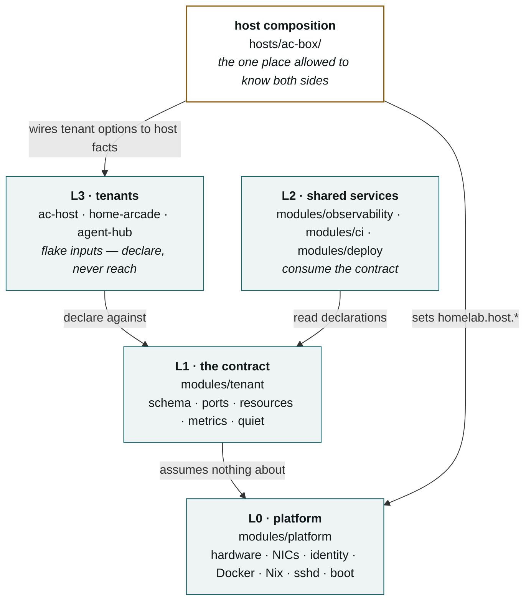
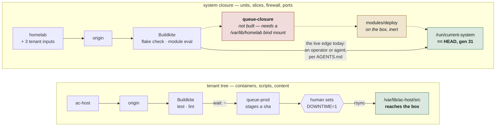
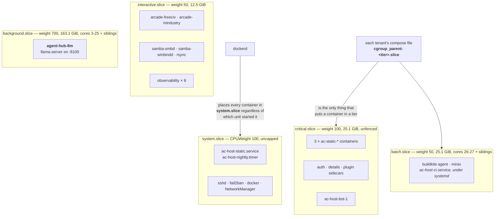
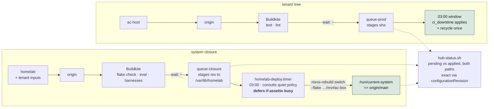
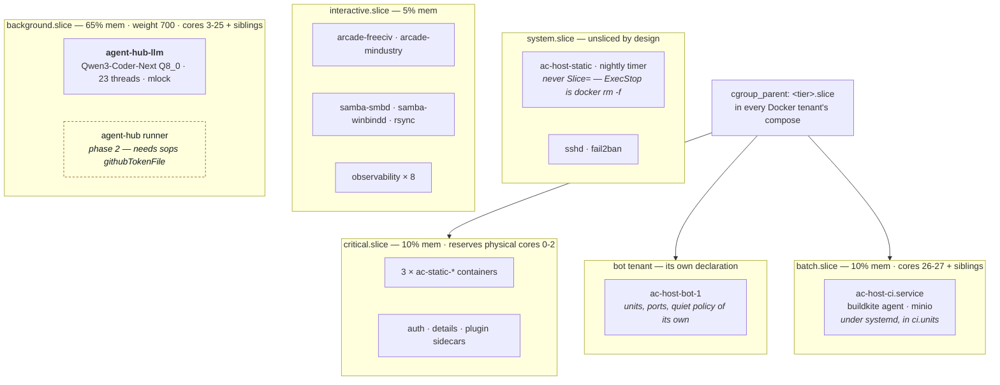

# Architecture

Two architectures, and the distance between them.

**Part I** is what ac-box enforces *today*, read off the box rather than off the
config. As of 12 Sep 2026 those are the same thing — generation 31 is HEAD,
store-path exact — but the rule stands, because the three days before that
they were 25 commits apart and drawing the config as the current state is how
this repo's stale comments got written.
**Part II** is the target: not a wish list, but the design the repo already
commits to in `README.md`, the ADRs and the module headers, drawn as one
picture. **Part III** is the delta — every gap between the two, what closes it,
and where that stands.

Mermaid rather than an image or a hosted link, so a diagram is reviewed in the
same diff as the change it describes and corrected when the code moves. Facts
here are load-bearing and dated; when one stops being true, fix it in the same
commit that made it false. Part I last verified against the box **12 Sep 2026, after the switch to
generation 31** (HEAD `c97cbbe`).

---

# Part I — Current

## I.1 The layers

The structure is already the target structure; this is the one part of the
design that is fully built. `README.md` states it as a table. The part a table
cannot show is that the dependency arrow only ever points one way.

**L0 knows nothing about tenants. L1 knows only the schema. L2 reads
declarations. L3 declares without knowing its neighbours.** A module that
reaches sideways or guesses a host fact instead of reading it is the bug this
structure makes visible — `modules/observability` carried `192.168.1.1` twice
until `6e18170`, and that was the last such literal in the module layer.

## I.2 How code reaches the box today

The single most misread thing about this machine. Two entirely separate routes
share a CI system and nothing else, and only one of them is wired.

Both paths still end at an operator. The top one ends at a human **who is prompted** —
`queue-prod` stages a sha and `hub-status.sh` reports it pending until applied.
The bottom one stages nothing and, until `1c6827f`, was checked by nothing;
it is *current* today because an operator switched it, not because anything
would have noticed if they had not.
`home-arcade` and `agent-hub` are flake inputs, not deploy targets: they reach
the box only through homelab's closure and inherit the same stall.

**Why the missing edge is not simply a Buildkite step** (ADR 0006): the agent
that would run it is a container *on ac-box*, and once `homelab.ci.enable`
lands it is a systemd unit owned by the very closure being switched. A switch
running on it kills the job midway — a circularity, not a risk to be managed.

## I.3 Where work runs today

Live values from `systemctl show`. These are the *old* tier defaults; the
rebalance is among the undeployed commits.

**Assetto's containers are fenced; its units are not.** `ac-host-static.service`
stays in `system.slice` on purpose — `resources.nix` assigns `Slice=` only when
`tier != critical` **and** `quiet.drainable`, because `Slice=` applies at unit
start and restarting `ac-host-static` means `docker rm -f` on three live race
servers.

**The fence now fences.** Until generation 30, `background` and `batch` both
carried `AllowedCPUs = 28-55` — on this dual E5-2680 v4 those are the SMT
*siblings* of 0–27, so the fence handed the yielding tiers the second thread of
every core and isolated nothing. `3fef4fe` does the arithmetic in physical
cores: background holds 3–25 and siblings 31–53, batch 26–27 and 54–55, and
cores 0–2 with siblings 28–30 stay with the unsliced racing stack. Background's
weight 700 against `system.slice`'s 100 ranks the model server *above* racing
under contention — deliberate; the fence is what protects racing, not the
weight.

**Slicing the unit that runs `docker compose` does nothing.** `dockerd` places
container scopes under `system.slice` no matter who invoked it. Only
`cgroup_parent` in the tenant's own compose file moves a container (ADR 0005).

## I.4 Tenants, network, secrets — as enforced

| | Current |
| --- | --- |
| **Tenants** | 5 declared and 5 in the inventory: `assetto` (bot still inside it as a compose profile), `arcade`, `agent-hub` (**running**), `observability`, `ci` (**under systemd**, `units = [ "ac-host-ci.service" ]`). |
| **Network** | `enp8s0` carries everything — LAN, forwarded AC traffic, sshd. `eno1` is cabled and **down**; `mgmt` scope exists in the schema and nothing may use it until the interface has an address. |
| **Secrets** | Hand-placed files: `/var/lib/monitoring/secrets/*`, `compose/.env.buildkite`, `whitelist.json`. `tenants.<name>.secrets` names them; nothing provisions them. |
| **Metrics** | Five scrape jobs, all loopback. `agent-hub-llm` serves `/metrics` on the LAN address and is unscraped — `metricsEndpoint` has no address field. |
| **Gates** | Every tree evaluated (`1c6827f`), skips counted. `agent-hub`'s enable flag is now true in the composition, so its body is reached by the composed eval. |
| **Reporting** | `hub-status.sh` reports closure drift as a hard lower bound; exact mode behind `HUB_STATUS_EXACT=1` says CLEAN. `Configuration Revision: Unknown` on every generation. |

---

# Part II — Target

What the repo already says it is building, drawn as one picture. Every claim
below is sourced to a file that states it; nothing here is invented for the
diagram.

## II.1 How code reaches the box

Both paths staged in CI, both applied on the box by systemd inside the
maintenance window, both reported as a pending/applied pair. **No human at an
SSH prompt on the path.** (ADR 0006, `README.md` goal 3.)

Properties the target must hold, none optional (ADR 0006 "Consequences"):

- **The drain policy is consulted, never assumed.** The deploy unit's
  `busyCheck` is the only thing between a merge and `docker rm -f` on live race
  servers. It defers; it never drains. It fails closed if the inventory is
  unreadable. *Built and tested — `modules/deploy`.*
- **Every tree that reaches the box has a real gate**, including `agent-hub`'s
  config body once its enable flag is on in the composition.
- **`deploy=buildkite` for homelab in `hub/repos.psv`** — at which point
  `agent-push=yes` means an agent pushing green is, indirectly, scheduling a
  system switch. Reconsider that flag at the same time, not after.

## II.2 Where work runs

The fence computed in **physical cores** and expanded through
`threadsPerCore` (`3fef4fe`); shares rebalanced to point the machine at the
model server (`45f67ab`, `0de8c09`); every workload in a tier and every tier
holding what it exists for.

Two consequences `configuration.nix` states out loud and the picture should
too: **background's CPUWeight 700 ranks the model server above racing under
contention**, because assetto's processes live in `system.slice` at weight 100.
That is deliberate. What protects racing is the *fence* — cores 0–2 and their
siblings are outside background's and batch's `AllowedCPUs` entirely — not the
weight. And **`critical.cpuShare` is not about how much CPU assetto gets**: its
slice is empty. It is the input to `reservedForCritical`, i.e. how many
physical cores the fence keeps for everything unsliced.

## II.3 Tenants, network, secrets — as designed

| | Target | Stated in |
| --- | --- | --- |
| **Tenants** | 6: `assetto`, `bot` (split out — "after phase 6", which has landed), `arcade`, `agent-hub` (llm **and** runner), `observability`, `ci` (`units = [ "ac-host-ci.service" ]`). Every running unit in exactly one tenant's `units`. | `README.md` tenant names; `modules/ci` header; `configuration.nix` agent-hub block |
| **Network** | `eno1` up as the **management** interface, with an address, so `scope = "mgmt"` stops being a schema-only word and `ports.nix` can open something on it. **Which services move there is not stated anywhere in the repo** — sshd and the observability UIs are the obvious candidates, but that is a decision to record (an ADR), not a fact to draw. | `host.nix` ("the dual-NIC runbook brings this up as management"); `schema.nix` `portScope`; ADR 0004 |
| **Secrets** | Credentials via **sops-nix**, named in `tenants.<name>.secrets` and provisioned by the platform. `whitelist.json` stays box state, by design — third-party IDs, never git. | `README.md` "Everything is public except one file"; `schema.nix` `secrets` |
| **Metrics** | Every tenant with an endpoint scraped, including `agent-hub-llm` on the LAN address — needs `metricsEndpoint.address`, a **schema** change, not a `metrics.nix` change. | `metrics.nix` header; `tenants.nix` agent-hub `metrics = null` comment |
| **Gates** | Composed eval reaches every module body that will run; harnesses exposed as flake `checks` (expected-throw cases inverted via `tryEval`). | `docs/current-state.md` F7 follow-up |
| **Reporting** | `system.configurationRevision` set from the flake, so the running closure is self-identifying and drift is exact, not a lower bound. | ADR 0006 "Reporting" — pending a ruling on the no-op-proof trade |
| **Reuse** | `modules/observability`, `modules/ci`, `modules/deploy` exported as `nixosModules`, so a second host takes the layer without taking ac-box's tenants. | `flake.nix` `nixosModules` comment; F4 |
| **Box hygiene** | `/etc/nixos/configuration.nix` a `throw`; `wpa_supplicant` off via `mkForce` in `network.nix`; reboot taken so booted == current. | `docs/runbook-decommission.md` |

---

# Part III — The delta

Every gap between Part I and Part II, what closes it, and where that stands as
of 12 Sep 2026. **Human** means a write to ac-box or a decision; agents do not
do those. Ordered roughly by what unblocks what.

| # | Gap | Closes it | Status |
| --- | --- | --- | --- |
| 1 | 25 commits committed, not on the box | Two switches, `3fef4fe` then HEAD, after HAZARD 1 | **Done 12 Sep** — generations 30 and 31. `HUB_STATUS_EXACT=1` reports CLEAN. |
| 2 | Closure has no deploy path | ADR 0006: `queue-closure` step + `modules/deploy` | Applying half **built, inert, tested**. Staging half **blocked**: the agent mounts only `/var/lib/ac-host`; a `/var/lib/homelab` bind mount must land in `ac-host`'s `docker-compose.buildkite.yml` (one place — `modules/ci` runs that file, it declares no volumes). |
| 3 | Fence is `28-55` on both tiers | `3fef4fe` | **Done** — live at gen 30. |
| 4 | `agent-hub-llm` absent; `tcp/8100` open with nothing behind it | `45f67ab`, `3fef4fe` | **Done** — `llama-server` on `192.168.1.50:8100` since gen 31. |
| 5 | CI stack hand-started, no unit | `4257aea` + HAZARD 1 | **Done** — `ac-host-ci.service` active at gen 31, same volumes. Found and fixed `c97cbbe` in the doing. |
| 6 | Tier shares are the old defaults | `45f67ab`, `0de8c09` | **Done** — live at gen 31. |
| 7 | `ci.units = []` — `ac-host-ci.service` lands in no slice even after #5 | Add it to `ci.units` | **Done** — `214cfdd`, live at gen 31. |
| 8 | Bot is a compose profile inside assetto | Split into a `bot` tenant | **Open.** Design decision: name, ports, quiet policy. Deferral expired at phase 6. |
| 9 | `agent-hub` runner off | sops-backed `githubTokenFile` (`homelab-bqo.10`) + runner image | **Open.** Depends on #10. |
| 10 | Secrets hand-placed | sops-nix | **Open.** No provisioning exists yet. |
| 11 | `eno1` down; `mgmt` scope unused | Dual-NIC runbook, **plus an ADR** deciding what moves to `mgmt` — the repo names the interface's role and nothing else | **Human.** Interface work on the box; the placement decision is unmade. |
| 12 | `agent-hub` metrics unscraped | `metricsEndpoint.address` | **Open.** Schema change. |
| 13 | `agent-hub` body ungated | Turn its enable on in the composition | **Done** — enable is true in the composition, so the composed eval reaches the body. |
| 14 | Harnesses not flake `checks` | `tryEval` inversion in the harnesses | **Open.** Design task; makes `run-eval-tests.sh` largely redundant. |
| 15 | L2 not exported as `nixosModules` (F4) | `flake.nix` | **Open.** Small; matters only once there is a second host. |
| 16 | `Configuration Revision: Unknown` | `system.configurationRevision = self.rev or self.dirtyRev` | **Human ruling.** Retires the "compare drvPath before/after" no-op proof this repo leans on. Buys speed only; `HUB_STATUS_EXACT=1` is already exact. |
| 17 | `/etc/nixos/configuration.nix` stale | Replace with a `throw` | **Done 12 Sep.** |
| 18 | `wpa_supplicant` on a box with no wireless | `networking.wireless.enable = lib.mkForce false` in `network.nix` | **Done** — gone at gen 31. |
| 19 | Booted ≠ current | Reboot | **Human, now safe** — #5 is done, so `ac-host-ci` returns on boot. No kernel change pending. |
| 20 | 13 containers → 9, unexplained | Establish whether four were retired deliberately | **Open.** Until settled, the cutover runbook's success criterion 4 cannot be evaluated. |
| 21 | `agent-push=yes` on homelab will mean "schedule a switch" once #2 is live | Reconsider the flag alongside #2 | **Human decision.** |

### What the delta says, read as a whole

Rows 1 and 3–7, 13, 17, 18 closed on 12 Sep in two switches. Rows 8–10 are the
tenant model finishing what phase 6 started. Rows 11–12 are the two schema words — `mgmt`, `metricsEndpoint.address`
— that exist in the contract and nothing uses yet. Rows 2 and 21 are the
change that makes the box self-switching, and they should land together and
deliberately.

The thing that has actually changed since this repo began is not the code —
the layers, the contract and the tiers were built early and built well. It is
**observability of the gap**: `hub-status.sh` now reports what the box runs
versus what main says, and the difference is a number rather than a
surprise. Part III is that number, itemised.
