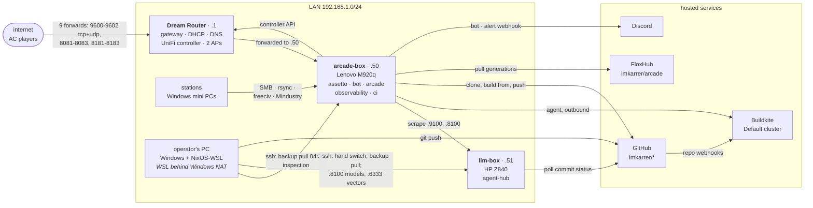

# Topology

The map of the lab: which machines exist, how they are wired, what runs on
each, and what crosses between them. Present tense only. History lives in
[`current-state.md`](current-state.md), [`architecture.md`](architecture.md),
the runbooks and the ADRs. Each fact names where it is decided: a file in
git, or the machine or service that holds it.

**Volatile state is not in this file.** Which sha each host runs, which
generation is applied, what is staged and whether a reboot is owed:
`bash scripts/hub-status.sh` answers those in about five seconds, and a copy
here would be stale by the next push.

**Last verified: 29 Sep 2026, 19:50 CDT.** Both hosts were read over ssh,
read-only (`ss`, `iptables`, `ip`, `lsblk`, `docker ps`, `systemctl`,
`/etc/homelab/tenants.json`), and the access points from `unifi-poller`'s
metrics. Declared values are from homelab `7a644ec`, which both hosts ran.
The router's reservations and forwards are not in code. The operator read
them off the Dream Router's UI on 26 Sep 2026.

---

## The lab at a glance



---

## Machines

| Machine | What it is | Address | Role | How its configuration arrives |
| --- | --- | --- | --- | --- |
| **Dream Router** | UniFi Dream Router: gateway, DHCP, DNS and the UniFi controller | `192.168.1.1` | The LAN's default route and resolver for both hosts; the nine lobby forwards; the controller API that `unifi-poller` and `udr-fw-exporter` read (`homelab.host.unifi.address`) | By hand in the UniFi UI. Nothing in git drives it. `unifi_pf.py` could manage the forwards but is off: the tenant's `.env` template in `modules/platform/secrets.nix` carries no `UNIFI_*` keys |
| Access points | Two UniFi access points, adopted by the router (`unifi-poller`'s device metrics) | DHCP | Wi-Fi | The router |
| **arcade-box** | Lenovo ThinkCentre M920q Tiny: i7-8700T, 6 cores / 12 threads, 31 GiB, 954 GB NVMe (`lscpu`, `/proc/meminfo`, `lsblk`) | `192.168.1.50` on `eno2` | Every tenant except `agent-hub`, and the only Buildkite agent | By itself. A green push to homelab `main` is staged by its own agent and switched by `homelab-deploy` within a minute. It defers while anyone races and during the 03:00–03:30 blackout (ADR 0006, ADR 0008) |
| **llm-box** | HP Z840: 2 × Xeon E5-2680 v4, 28 cores / 56 threads, 251 GiB, 1 TB NVMe (a WD_BLACK SN850X). No GPU is on the PCI bus, so inference is CPU-only. `host.nix` still says `gpu = "nvidia"` (`homelab-9di`). Sources: `lscpu`, `free`, `lsblk`, the PCI class list in sysfs | `192.168.1.51` on `enp8s0` | `agent-hub` and nothing else | By hand: `nixos-rebuild switch --refresh --flake github:imkarrer/homelab/<full-sha>#llm-box`, from a sha already on origin (ADR 0010) |
| **operator's PC** | Windows with an RTX 4080, and NixOS-WSL 26.05 inside | Windows leases from the pool; WSL sits behind Windows' NAT, so nothing on the LAN can reach WSL | The registry checkouts, the `bd` tracker, the `hub-*` scripts and the nightly backup; `bead-loop`; a second agent-hub model server on the RTX 4080 (llama-swap on WSL's `127.0.0.1:8100`), which `gpu-mode-guard` stops while a game runs | Its own flake, `imkarrer/flox-workstation` (`~/src/workstation`). Two pieces of this lab reach it as pinned inputs of that flake: see [How code reaches each machine](#how-code-reaches-each-machine) |
| **stations** | The arcade's Windows mini PCs (8th-gen i5, Intel iGPU; `home-arcade` README) | DHCP pool | Arcade clients. They mount `/srv/arcade` over SMB (read-only) or rsync it, push player saves to the `arcade-saves` SMB share (`/srv/arcade/saves`, read-write), and join freeciv and Mindustry | `home-arcade`'s `windows/` setup |

**Not built: ci-box.** A dedicated Tiny for `ci`, so the gates stop sharing
arcade-box with the lobbies. ADR 0012 is drafted but not yet in `docs/adr/`
(`homelab-bfq.14`), and the hardware is not bought (`homelab-bfq`).

---

## Network

One flat `/24` behind the Dream Router. Neither host configures its own
address: both lease by DHCP (`ipv4.method auto`), and a reservation on each
MAC pins the address. `hosts/<host>/host.nix` declares that address. The
reservation itself lives only on the router, and the table below is this
repo's current record of it.

| | |
| --- | --- |
| DHCP pool | `192.168.1.6`–`.254`, one pool |
| Reservation: arcade-box | `e8:6a:64:f4:81:94` (`eno2`, the M920q's one wired port) → `192.168.1.50` |
| Reservation: llm-box | `c8:d3:ff:b9:28:0b` (`enp8s0`) → `192.168.1.51` |
| Port forwards | Nine hand-set rules, `ac-prod-s{0,1,2}-{game,http,details}`, all to `192.168.1.50`: game 9600–9602 tcp+udp, http 8081–8083 tcp, details 8181–8183 tcp. They cover the three lobby slots. `.50` moved to arcade-box with the lobbies at the cutover, so the rules never changed |
| arcade-box's other port | `wlo1`, Wi-Fi, disabled (`networking.wireless.enable = mkForce false`) |
| llm-box's other port | `eno1` (`c8:d3:ff:b9:28:0a`): no cable, no carrier, no address. It is declared as the `mgmt` scope with `address = null`, and nothing is scoped to it (ADR 0007) |

**On llm-box the one right cable is `enp8s0`.** `eno1`'s MAC has no
reservation. If NetworkManager brings it up, it leases an address from the
pool that nothing knows: not `~/.ssh/config`, not arcade-box's peer entry, not
the operator's script defaults. `.51` then goes away with `enp8s0`'s link.
nginx, qdrant and the node exporter bind `192.168.1.51` and fail to start
without it, and the firewall opens their ports on `enp8s0` only. Cabling both
ports on one LAN gives the Z840 two leases and two default routes and opens
nothing on the second, which isolates nothing; that is why ADR 0007 plugs
nothing in. This happened on 13 Sep 2026 (`homelab-bqo.42`). The check is
`ip -br addr show enp8s0` reading `.51`.

**Port scopes** (README, pinned; `modules/tenant/ports.nix`):

- `local` never touches the firewall and is meant for loopback. Two such
  services bind wider, Alertmanager's mesh on 9094 and the lobbies' plugin
  ports on 11200+, and the firewall is what refuses them.
- `lan` opens the port on the host's LAN interface.
- `forwarded` is `lan` plus a router forward, and it needs a `justification`.
- `mgmt` is declared for llm-box's `eno1` and used by nothing.

sshd's 22/tcp is open on every interface of both hosts: `modules/platform/ssh.nix`
leaves openssh's own `openFirewall` at its default. That is the one opening
outside the port registry, apart from llm-box's node exporter.

---

## What runs where

"Reachable" lists the ports a `lan` or `forwarded` scope opens. Every other
port a tenant claims is `local`, which the firewall never opens. The declared
set for a host prints with:

```bash
NIX_CONFIG='experimental-features = nix-command flakes' nix eval --json \
  .#nixosConfigurations.<host>.config.homelab.tenants \
  --apply 'ts: builtins.mapAttrs (n: t: { inherit (t) tier units; ports = t.ports; portRanges = t.portRanges; state = t.state; data = t.data; drainable = t.quiet.drainable; }) ts'
```

### arcade-box

| Tenant | Tier | What runs | Reachable | State |
| --- | --- | --- | --- | --- |
| `assetto` | critical; not drainable | `ac-host-static` starts the three lobbies with `docker run` (`acctl.py up-static`): one `ac-static-<id>` container per lobby entry in ac-host's `catalog/statics.json`. The sidecars `ac-host-{auth,details,plugin}-1` are compose services in project `ac-host`. `ac-host-nightly.timer` also runs here | forwarded: game 9600+ tcp+udp, http 8081+, details 8181+. Each range declares 16 slots and the firewall opens all 16; 3 are live, and only those 3 are forwarded | `/var/lib/ac-host`, plus the `ac-host_ac-server` volume, the AC dedicated server that anonymous steamcmd cannot reinstall; both backed up |
| `bot` | critical | `ac-host-bot` runs `ac-host-bot-1`, the Discord bot, a compose service in the same project. It queues the 03:00 DOWNTIME build | none | Shares `/var/lib/ac-host`. `whitelist.json` there is the one file that is never in git |
| `arcade` | interactive | `arcade-freeciv` and `arcade-mindustry`, a flox environment from FloxHub `imkarrer/arcade` (ADR 0009); `samba-smbd`, `samba-winbindd`, `rsync`; `arcade-library-sync`, which fills `/srv/arcade` from home-arcade `main` | lan: freeciv 5556/tcp and 4555/udp; Mindustry 6567 tcp+udp and 20151/udp; SMB 445 and 139; rsync 873 | `/var/lib/arcade` (saves, backed up); `/srv/arcade` (the stations' share, not backed up -- including `saves/`, the players' roaming saves since homelab-zvi; every station that played a profile keeps its own copy) |
| `observability` | interactive | Native units: Prometheus, Alertmanager, Grafana, node exporter, cAdvisor, `unifi-poller`, `udr-fw-exporter`, `docker-name-exporter` | lan: Grafana 3000. Everything else is `local` | `/var/lib/grafana`, `/var/lib/prometheus2`, both backed up |
| `ci` | batch | `ac-host-ci` runs three containers. `ac-host-ci-agent-1` is the Buildkite agent `arcade-box` on `queue=self`, privileged so that Nix's sandbox engages. `ac-host-ci-minio-1` is the CI binary cache, and a one-shot `minio-init` sets it up | none: MinIO on loopback 9000/9001, which the host's own nix-daemon also reads as a substituter | None declared. The cache lives in the `ac-host-ci_minio-data` volume: rebuildable, not backed up |

Platform pieces on arcade-box: sshd with fail2ban, Docker, nix-daemon,
sops-nix, `homelab-deploy.{path,timer}` (the closure edge) and
`arcade-environment-pull` (the environment edge). Tiers are CPU weights and
memory ceilings with no cpuset fence
(`homelab.tiers.{background,batch}.fence = false`); `current-state.md` §3
has the numbers.

### llm-box

| Tenant | Tier | What runs | Reachable | State |
| --- | --- | --- | --- | --- |
| `agent-hub` | background, declared only: this host has no tier slices (`homelab.enforce.slices = false`) | `agent-hub-llm`: llama-swap on `127.0.0.1:8100` starts `llama-server` on demand, for the models `services.agent-hub.llm.models` lists in `hosts/llm-box/configuration.nix`, from the flox environment at `/var/lib/agent-hub/env`. It runs on all 28 physical cores (`AllowedCPUs = 0-27`, placement rather than a fence). Also `nginx` and `qdrant` | lan: 8100, where nginx proxies llama-swap (also the scrape target); 6333, qdrant, which binds the LAN address only | `/var/lib/agent-hub`, `/var/lib/qdrant`, both backed up; `/srv/agent-hub`, the model files, not backed up |

Platform pieces on llm-box: sshd with fail2ban, and the node exporter on
`192.168.1.51:9100`. The node exporter is opened on `enp8s0` only, and it is
not in the port registry because it belongs to the platform, not a tenant
(`modules/platform/node-exporter.nix`). Two environment units form its one
automatic edge, `agent-hub-environment-poll` and `-pull`. `homelab-deploy`
is armed and idle here, because nothing stages a closure on this host. There
is no Docker and no secrets module.

---

## What crosses between machines

| Flow | From → to | Carried on | When | Decided in |
| --- | --- | --- | --- | --- |
| Racing | internet → router → arcade-box | the nine forwards | always | the router; `hosts/arcade-box/tenants.nix` |
| Arcade play and files | stations → arcade-box | freeciv, Mindustry, SMB, rsync | on demand | `hosts/arcade-box/tenants/arcade.nix` |
| Host metrics | arcade-box's Prometheus → llm-box | `:9100` node, `:8100` agent-hub through nginx | every scrape | `homelab.host.peers` in `hosts/arcade-box/host.nix` |
| Router metrics | arcade-box → router | UniFi controller API over https | `unifi-poller` at every scrape; `udr-fw-exporter` every 5 minutes, on its own clock | `homelab.host.unifi.address`; `modules/observability` |
| Alerts | arcade-box → Discord | Alertmanager's webhook | on alert | `modules/observability` |
| Models and vectors | operator's PC → llm-box | `:8100`, `:6333` | on demand | the defaults in `hub-ask.sh`, `hub-index.sh`, `hub-search.sh` |
| Backup | both hosts → operator's PC | ssh as root with rsync, pulled by the PC; then restic into `/home/nixos/backup/restic` on the PC | 04:30 nightly | `scripts/hub-backup.sh`, `hub/systemd/hub-backup.timer`, `docs/runbook-restore.md` |
| Inspection and hand switches | operator's PC → both hosts | ssh | by hand | AGENTS.md, "The hosts are read-only" |

### How code reaches each machine

| Tree | Lands on | Edge |
| --- | --- | --- |
| `homelab` | arcade-box | push → Buildkite on arcade-box's agent → `queue-closure` → `homelab-deploy` switches within a minute, unless drivers are racing or it is the 03:00–03:30 blackout (ADR 0006, ADR 0008) |
| `homelab` | llm-box | an operator's hand switch from a sha on origin (ADR 0010) |
| `homelab` | operator's PC | `hub/systemd/hub-backup.{service,timer}`, taken as a source input of `flox-workstation` and pinned in that repo's `flake.lock`, so the PC moves only when that pin is bumped |
| `ac-host`, the tenant tree | arcade-box | push → `queue-prod` stages it → the bot's DOWNTIME build at 03:00 applies it and recycles the lobbies |
| `ac-host`, its module | arcade-box | green build → a bump-lock commit to homelab → the `homelab` edge |
| `home-arcade` | arcade-box | green build publishes a FloxHub generation → `queue-environment` → `arcade-environment-pull` (ADR 0009) |
| `home-arcade`, its station files | arcade-box | merge to `main` → `arcade-library-sync.timer`, every 10 minutes, fetches it into `/var/lib/arcade/home-arcade` and copies `catalog/`, `www/`, `metadata/`, `shaders/`, `windows/` into `/srv/arcade` without `--delete`; the stations robocopy the share (`homelab-786`) |
| `agent-hub` | llm-box | green build publishes the `buildkite/agent-hub` commit status → llm-box's own 10-minute poll stages the sha → `agent-hub-environment-pull` (`homelab-ygc.14`) |
| `agent-hub` | operator's PC | a flake input of `flox-workstation`, pinned by sha in its `flake.nix` at the module form from before ADR 0009 |
| `bead-loop` | operator's PC | Buildkite tests and automerges; the PC pulls `main` itself (`bead-loop-deploy.timer`) |

The rows that land on a host come from the registry, `hub/repos.psv`, and
[`architecture.md`](architecture.md) I.2 draws them; so does the `bead-loop`
row, with bead-loop's own timer. The two pinned-input rows come from
`flox-workstation`'s `flake.nix`.

---

## Hosted services

| Service | Used for | Talks to it | Configured in |
| --- | --- | --- | --- |
| GitHub, `imkarrer/*` | Origin of every tree. Repo webhooks start builds, and commit statuses are what llm-box's poll reads | The operator's PC pushes. arcade-box's agent clones every tree and pushes bump-lock commits and the racing site to `imkarrer/ac-practice`; its `homelab-deploy` builds from `github:imkarrer/homelab/<rev>`. llm-box polls, and a hand switch builds from a `github:` ref | `hub/repos.psv`; `modules/deploy`; the `ci-env` template in `modules/platform/secrets.nix` |
| Buildkite, org `isaac-karrer`, Default cluster | Eight pipelines, all on the one agent `arcade-box`: the five registry trees (`homelab`, `ac-host`, `agent-hub`, `home-arcade`, `bead-loop`), `ac-host-ops` (the DOWNTIME build), and two outside the registry, `flox-buildkite-plugin` and the private `inquire-platform` | arcade-box's agent (outbound), the bot, the hub scripts | `hub/pipelines/*.json` through `scripts/hub-pipeline.sh` for four of them; the rest are Buildkite UI objects. `docs/runbook-ci-cache-garage.md` §1 lists all eight in the cluster as of 29 Sep. The tenant's env also names `ac-host-series`, which does not exist (`homelab-bqo.55`) |
| FloxHub, `imkarrer/arcade` | arcade's generations | `home-arcade`'s CI pushes them, arcade-box pulls them | `homelab.tenants.arcade.environment.source` in `hosts/arcade-box/configuration.nix` |
| `cache.nixos.org`, `cache.flox.dev` | Binary substituters. arcade-box also reads the CI cache on loopback; llm-box cannot reach that cache | both hosts | `cache.flox.dev` from `modules/platform/flox.nix`; `cache.nixos.org` is NixOS's default; the CI cache on arcade-box from `modules/ci` |
| Discord | The bot's server, and Alertmanager's webhook | arcade-box | ac-host's bot; `modules/observability` (the `discord-webhook` secret) |
| Steam | The AC dedicated server, installed once by steamcmd | arcade-box | ac-host; the `ac-host_ac-server` volume holds the install |

---

## Where secrets live

- **`secrets/ac-box.yaml`**, encrypted with sops, is in git. It is decrypted
  at activation on arcade-box alone (`modules/platform/secrets.nix`). Its
  recipients (`.sops.yaml`) are arcade-box's host key, the operator's key,
  and the Z840's host key. The Z840 no longer needs to decrypt anything, but
  its key still can, which is why the re-key below matters.
- **llm-box** imports no secrets module.
- **The operator's PC** decrypts for the hub scripts through
  `scripts/lib/sops-secret.sh`, with the operator's key.
- **`whitelist.json`**, the players' Steam and Discord ids, is arcade-box
  state and is never in git (README, "Everything is public except one file").

---

## Clocks

Both hosts run America/Chicago, and so does the backup timer.

| When | What | Where | Decided in |
| --- | --- | --- | --- |
| 03:00 | The window opens. The bot queues DOWNTIME (`ac-host-ops`), which applies a staged tenant tree and recycles the lobbies; `ac-host-nightly` also recycles (`homelab-bqo.46`) | arcade-box | `homelab.host.maintenance.window` in `hosts/arcade-box/host.nix`; the bot's countdown and `ac-host-nightly.timer` in ac-host |
| 03:00–03:30 | `homelab-deploy` blackout: no closure switch into the drain | arcade-box | starts at `homelab.host.maintenance.window`; `windowOffsetMinutes` in `modules/deploy` sets its end |
| every 10 min | `homelab-deploy` retries a deferred switch | arcade-box | `retryInterval` in `modules/deploy` |
| every 10 min | `agent-hub-environment-poll` asks GitHub for a green sha | llm-box | `modules/tenant/environment-poll.nix` |
| 04:30 | `hub-backup` pulls both hosts | operator's PC | `hub/systemd/hub-backup.timer` |

---

## Decided, not yet live

Each item below redraws part of this map. The commit that makes one true
updates the table it changes.

- **The CI cache moves from MinIO to Garage** (ADR 0013, `homelab-ygc.20`).
  Garage becomes a native unit of the `ci` tenant, and llm-box can
  substitute from it over the LAN. Its S3 port is a `local` port that the
  firewall opens on the CI bridge alone, so the port-scope lines above change
  with it. MinIO leaves a week after the switch.
- **The secrets file becomes arcade-box's.** `secrets/arcade-box.yaml` is
  re-keyed without the Z840's key (`homelab-ygc.9`,
  `docs/runbook-llm-box-rename.md` section 5).
- **The Z840's disk is stripped** of the state that moved at the cutover
  (`homelab-ygc.9`; runbook section 6.1 measures it).
- **llm-box drops its idle `homelab-deploy` units** (`homelab-ygc.23`).
- **ci-box**, if ADR 0012 is accepted (`homelab-bfq`).

---

## Keeping this current

- **Same commit.** A commit changes this file when it moves a machine, an
  address, a tenant, a unit, a state path, a `lan` or `forwarded` port, a
  delivery edge, a schedule, a hosted service or a secret's home. Facts set
  outside this repo (the router, Buildkite's UI, FloxHub, `flox-workstation`'s
  pins) are updated the day they change, with the date.
- **Re-verify** after any change of cutover size, and otherwise at least
  monthly. Print the declared set with the `nix eval` above. Read the live
  set with `ssh <host> 'ss -tulnpH; ip -br addr'` and `ssh arcade-box 'docker
  ps'`. Then move the date at the top. `current-state.md`, "Keeping this
  current", has the full survey.
